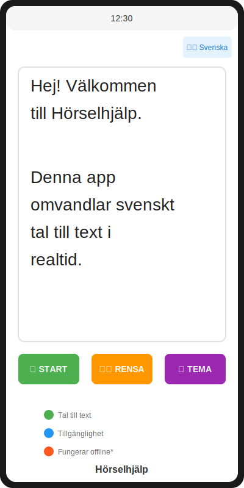

# Hörselhjälp - Visuell Dokumentation

Denna mapp innehåller visuella resurser och diagram för Hörselhjälp-appen.

## 📊 Översikt av visuella resurser

### Hero Image


Den huvudsakliga feature-bilden som visas i README. Visar appens huvudfunktioner:
- 🎤 Tal till text i realtid
- 👁️ Stora bokstäver för läsbarhet
- ♿ TalkBack-kompatibel
- 🇸🇪 Svenska & engelska språk
- 🌙 Ljust och mörkt läge
- 🔒 Offline och säker

### App i olika lägen


Jämförelse mellan ljust och mörkt läge, visar:
- Standard ljust läge med vit bakgrund
- Mörkt läge för dunkla miljöer
- Knapparna och deras funktioner
- Textvisning med stora bokstäver

### Användningsflöde


Steg-för-steg flödesschema som visar:
1. Öppna appen
2. Ge mikrofontillstånd
3. Tryck "STARTA TAL"
4. Tala på svenska eller engelska
5. Se texten visas i realtid

### Appens tillstånd


Visar appen i fyra olika tillstånd:
1. **Redo att starta** - Initialt tillstånd
2. **Lyssnar på tal** - Aktivt lyssnande med animering
3. **Text visas** - Efter lyckad transkribering
4. **Mörkt läge** - Alternativt tema

### Enkel Mockup


En enkel telefonmockup som visar appens gränssnitt.

## 📝 Textdokumentation

Se [app-feature-diagram.md](app-feature-diagram.md) för en detaljerad funktionsöversikt med:
- ASCII-baserad UI-mockup
- Steg-för-steg användningsinstruktioner
- Tillgänglighetsfunktioner
- Tekniska detaljer
- Exempel på användning
- Systemkrav

## 🎨 Användning av bilder

Alla SVG-bilder kan användas i markdown-dokument:

```markdown


```

## 📄 Filformat

Alla bilder är i SVG-format för:
- ✓ Skalbarhet utan kvalitetsförlust
- ✓ Små filstorlekar
- ✓ Fungerar direkt i GitHub markdown
- ✓ Lätta att redigera och uppdatera
- ✓ Tillgängliga och responsiva

## 🔄 Uppdateringar

För att uppdatera bilderna, redigera SVG-filerna direkt eller skapa nya versioner.
Alla bilder är skapade med inline SVG-kod för enkel redigering.

---

**Skapad för Hörselhjälp-projektet** • [GitHub Repository](https://github.com/Jonaskjellsson/Horselhjalp)
